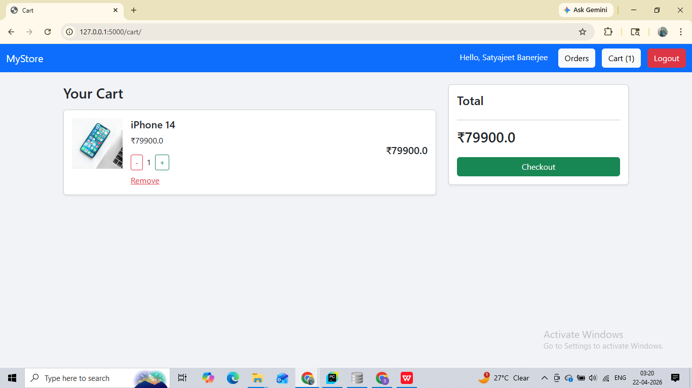
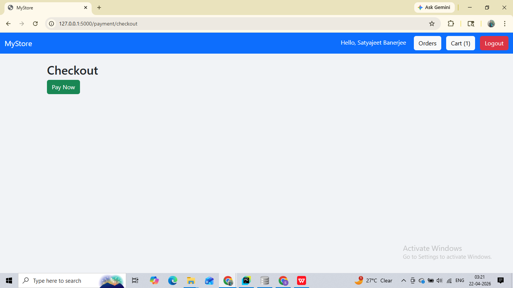
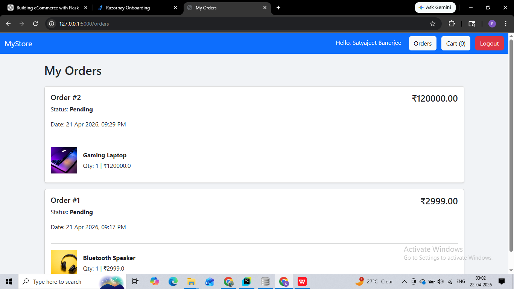
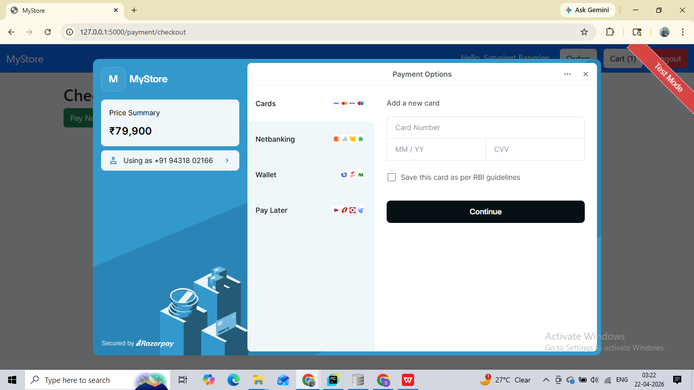

# 🛒 Flask E-commerce Store

A full-stack eCommerce web application built using Flask.

## 🚀 Features

- User Authentication (Login/Register)
- Product Listing & Detail Page
- Add to Cart with Quantity Control
- Razorpay Payment Integration (Test Mode)
- Order Management System
- Order History Page

## 🛠 Tech Stack

- Python (Flask)
- SQLAlchemy (Database)
- Jinja2 (Frontend)
- Bootstrap (UI)
- Razorpay API

## 📸 Screenshots

### Home Page


### Cart


### Checkout


### Orders


### Razorpay

## ⚙️ Setup Instructions

```bash
git clone https://github.com/your-username/flask-ecommerce-store.git
cd flask-ecommerce-store
pip install -r requirements.txt
python run.py
```
## 🔐 Environment Variables

Create .env file:
```
SECRET_KEY=your_secret_key
RAZORPAY_KEY_ID=your_key
RAZORPAY_SECRET_KEY=your_secret
```
## 💼 Author

Satyajeet Banerjee